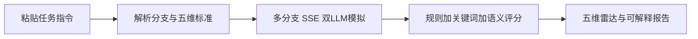

# ConvoMatrix · 复杂指令下的多轮对话评测系统

> **DialogEval** — 让 AI 从「会聊天」，走向「能办事」

将任意复杂、格式不统一的任务指令，自动解析为**统一五维评分标准**，通过多分支对话模拟与可解释报告，评测对话式 AI / 数字人「能不能把事办成」。

| 入口 | 说明 |
|------|------|
| 公开 Demo | 前端 [evaluation-system-beryl.vercel.app](https://evaluation-system-beryl.vercel.app) ；API [evaluation-system-api-xziw.onrender.com](https://evaluation-system-api-xziw.onrender.com/api/health) |
| 本地开发 | 后端 `8010` + 前端 Vite（见下方「快速开始」） |
| Docker 一键演示 | `docker compose up --build -d` → <http://localhost> |
| 产品介绍 | [`docs/项目介绍.md`](docs/项目介绍.md) |
| 评分机制 | [`docs/SCORING_MECHANISM.md`](docs/SCORING_MECHANISM.md) |

公开 Demo 的 Key 只在 Render 服务端。免费实例休眠后第一次打开可能要等几十秒。解析 / 模拟 / 评分会消耗部署者的模型额度。

---

## 核心能力

- **指令无关的统一评测**：粘贴业务 SOP 即可生成 rubric，无需为每条指令单独写脚本
- **复杂语义可拆解**：主动步骤 / 条件响应 / FAQ / 占位符分类评分，避免误扣与漏评
- **多分支覆盖**：自动生成配合型、拒绝型、质疑型等用户路径并分别跑测
- **可解释报告**：五维雷达图 + 每个子项的中文评分理由

---

## 系统流程



1. **输入**：粘贴任意格式业务指令（或选用预置 Demo）
2. **解析**：生成用户分支（persona）+ 统一五维评分标准（含可审计子项）
3. **模拟**：按分支跑流式多轮对话（Agent LLM ↔ User 模拟器）
4. **评分**：规则 / 关键词 / LLM 语义三通道并发打分并汇总
5. **报告**：总分、维度雷达、子项理由、优点与改进建议

---

## 统一五维评分框架

| 维度 | 权重 | 评估内容 |
|------|------|----------|
| 任务完成度 | 35% | 核心目标是否达成、流程步骤是否执行、FAQ 是否答准 |
| 指令遵循 | 25% | 字数限制、禁止词、避免重复等硬性约束 |
| 自然度 | 15% | 口语化程度、电话沟通感、是否符合角色设定 |
| 分支处理 | 15% | 条件场景下的应对是否恰当（挽留、超范围回复等） |
| 效率 | 10% | 是否在合理轮次内完成任务 |

评分点子项还会标注语义类型（`mandatory_step` / `conditional_response` / `faq_entry` / `constraint` / `opening`），按类型分流，避免「一刀切」误评。细节见 [`docs/SCORING_MECHANISM.md`](docs/SCORING_MECHANISM.md)。

---

## 关于 API Key（重要）

本仓库**不会、也不应**包含任何真实的 API Key。`.env` 已在 `.gitignore` 中忽略。

| 说明 | 详情 |
|------|------|
| **谁提供 Key？** | 每位使用者需自行注册 [DeepSeek 开放平台](https://platform.deepseek.com/) 并创建 API Key |
| **Key 存哪里？** | 仅写在本地 `backend/.env` 中，由**服务端**读取，不会提交到 Git |
| **前端页面的 Key 输入框？** | 仅为 UI 占位与格式校验，**后端会忽略**请求体中的 key，真实调用一律使用 `backend/.env` |
| **费用** | 解析、对话模拟、评分均会调用 DeepSeek API，消耗的是你账号下的额度 |

克隆仓库后，**必须先配置自己的 Key 才能完整运行**（解析 / 模拟 / 评分三步都依赖 LLM）。

---

## 环境要求

| 组件 | 版本 |
|------|------|
| Python | ≥ 3.10 |
| Node.js | ≥ 18 |
| DeepSeek API Key | 自行申请 |

---

## 快速开始（本地开发）

### 1. 克隆仓库

```bash
git clone https://github.com/lapocati/Evaluation-system.git
cd Evaluation-system
```

### 2. 配置 API Key

```bash
cd backend
cp .env.example .env
```

编辑 `backend/.env`，填入你的 Key（等号后不要加引号）：

```env
DEEPSEEK_API_KEY=sk-你的DeepSeek密钥
```

Key 申请地址：<https://platform.deepseek.com/api_keys>

### 3. 启动后端

```bash
cd backend
python -m venv .venv

# Windows PowerShell
.\.venv\Scripts\Activate.ps1

# macOS / Linux
# source .venv/bin/activate

pip install -r requirements.txt
uvicorn app.main:app --reload --port 8010
```

健康检查：<http://127.0.0.1:8010/api/health> → `{"status":"ok"}`

### 4. 启动前端

新开一个终端：

```bash
cd frontend
npm install
npm run dev
```

浏览器访问：<http://localhost:5173>

开发模式下前端直连 `http://127.0.0.1:8010`（见 `frontend/src/lib/apiBase.ts`）。

### 5. 体验 Demo

1. 打开配置页，选择预置指令（如「美团外卖·飞毛腿骑手通知」）
2. 点击 **解析指令** → 查看自动生成的分支与评分维度
3. 选择分支 **运行** → 观看流式对话
4. 对话结束后查看 **评测报告**（五维雷达 + 子项理由）

内置高复杂度样例：

- **美团外卖·飞毛腿骑手通知** — 外呼 SOP + FAQ + 条件挽留/鼓励 + 占位符
- **课程平台·直播升级客服** — 多步 Conversation Flow + 嵌套条件 + 特殊终止场景

---

## Docker 部署（生产 / 演示）

适用于在一台机器上通过 Nginx 统一对外提供前端与 API。

### 1. 配置 Key 并构建前端

```bash
# 配置服务端 Key
cp backend/.env.example backend/.env
# 编辑 backend/.env，填入 DEEPSEEK_API_KEY

# 构建前端静态资源
cd frontend
npm install
npm run build
cd ..
```

### 2. 启动容器

```bash
docker compose up --build -d
```

访问：<http://localhost>（80 端口）

- 前端：`/` → `frontend/dist`
- API：`/api/*` → 反向代理到 FastAPI `:8010`

停止服务：

```bash
docker compose down
```

---

## 项目结构

```
.
├── backend/                 # FastAPI 后端
│   ├── app/
│   │   ├── prompts/         # Parser / Scorer 等 Prompt
│   │   ├── routes/          # parse / simulate / evaluate API
│   │   └── scoring/         # 规则评分、聚合、归一化
│   ├── .env.example         # Key 配置模板（复制为 .env）
│   └── requirements.txt
├── frontend/                # Vite + React + TypeScript
│   └── src/
│       ├── pages/           # 配置 / 分支 / 模拟 / 报告
│       └── data/presets.ts  # 预置 Demo 指令
├── docs/
│   ├── 项目介绍.md          # 产品介绍（评委 / 文档用）
│   └── SCORING_MECHANISM.md # 评分机制说明
├── docker-compose.yml
└── nginx.conf
```

---

## API 概览

| 接口 | 方法 | 说明 |
|------|------|------|
| `/api/health` | GET | 健康检查 |
| `/api/parse_instruction` | POST | 解析任务指令 → 分支 + 评分标准 |
| `/api/simulate/stream` | POST | SSE 流式双 LLM 对话模拟 |
| `/api/evaluate` | POST | 对话结束后多维评分 + 报告 |
| `/api/evaluate/stream` | POST | 评测过程流式进度（可选） |

### 请求示例

**解析指令**

```http
POST /api/parse_instruction
Content-Type: application/json

{
  "instruction": "# Role\n你是客服...\n# Task\n通知用户...\n"
}
```

成功时返回 `branches`（含 `npc_persona`）、`scoring_criteria`（五维及子项）、可选 `tone_summary`。  
说明：请求体里的 `api_key` 字段已废弃，后端只读 `DEEPSEEK_API_KEY`。

**流式模拟**

```http
POST /api/simulate/stream
Content-Type: application/json

{
  "instruction": "...",
  "branch": { "id": "...", "name": "...", "description": "...", "npc_persona": "..." },
  "scoring_criteria": { "...": "与 parse 结果一致" }
}
```

响应为 SSE 事件流，按轮次推送 Agent / User 文本，直至结束或达最大轮次。

**评测**

```http
POST /api/evaluate
Content-Type: application/json

{
  "instruction": "...",
  "branch": { "...": "..." },
  "conversation": {
    "branch_id": "...",
    "turns": [{ "turn": 1, "role": "agent", "text": "..." }],
    "status": "ended",
    "total_turns": 6
  },
  "scoring_criteria": { "...": "..." },
  "evaluator_key": ""
}
```

返回 `overall`、各维度 `dimensions`、`efficiency`，以及 `advantages` / `improvements`。

---

## 常见问题

**Q：没有 Key 能打开页面吗？**  
可以打开前端，但点击「解析指令」时后端会报错：`服务端未配置 DeepSeek API Key`。必须配置 `backend/.env`。

**Q：可以用 OpenAI / 其他模型吗？**  
当前版本固定使用 DeepSeek `deepseek-chat`，更换模型需改后端 `app/llm/deepseek.py` 及相关配置。

**Q：Docker 启动后 502？**  
确认 `backend/.env` 中 Key 有效，且已执行 `frontend/npm run build` 生成 `frontend/dist`。

**Q：评分很慢？**  
单次评测会对多个子项并发调用 LLM，通常需 10–30 秒，属正常现象。

**Q：本地前端端口不是 5173？**  
Vite 可能自动落到 5174/5175；后端 CORS 已放行常见本地端口。确认 `frontend/src/lib/apiBase.ts` 指向的后端地址即可。

---

## 已知限制

- 模型供应商当前固定为 DeepSeek，未做多厂商抽象
- 无 Key 时仅可浏览前端 UI，无法完成解析 / 模拟 / 评分
- 复杂指令下 LLM 调用次数多，单次评测常见 10–30 秒
- 前端输入框中的 Key **不会**传到真实调用链路，避免误以为「填了就能用」却未配服务端 `.env`

---

## 技术栈

- **后端**：FastAPI · httpx · pydantic · sse-starlette · DeepSeek API
- **前端**：React 18 · TypeScript · Vite · Tailwind CSS · Zustand · Recharts
- **部署**：Docker · Nginx

---

## License

本项目为黑客松作品。如需商用或二次发布，请联系作者确认。
