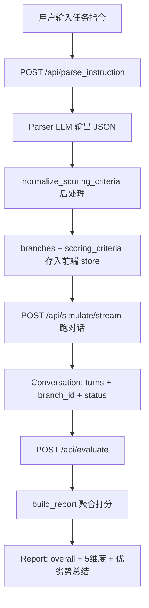

# DialogEval 评分系统机制说明（供改造讨论）

> 本文档描述当前评分系统的端到端逻辑、已知漏洞与改造方向，供 AI/开发者讨论改造方案。  
> **不参与构建与运行**，修改本文件不影响应用行为。

---

## 0. 系统定位

DialogEval 是一个**多轮对话自动评测**系统，流程为：

```
任务指令 → LLM 解析(分支 + 评分标准) → 双 LLM 模拟对话 → 多维度自动打分 → 报告
```

评分**不**在模拟过程中实时进行，而是在对话结束后，对完整 transcript 一次性打分。

---

## 1. 端到端数据流



**关键文件：**

| 阶段 | 文件 |
|------|------|
| 指令→评分标准 | `backend/app/prompts/parser.py` |
| 后处理归一化 | `backend/app/scoring/criteria_normalize.py` |
| 单子项打分 | `rules.py` / `keyword.py` / `llm_scorer.py` |
| 聚合 | `backend/app/scoring/aggregator.py` |
| LLM 评分 prompt | `backend/app/prompts/scorer.py` |

---

## 2. 评分标准如何产生（Parser 阶段）

### 2.1 Parser LLM 的输出结构

Parser 把任务指令解析成：

- **`branches`**：2–4 个用户分支（配合型/拒绝型/质疑型等），每个含 `npc_persona`（驱动用户模拟器）
- **`scoring_criteria`**：5 个维度，前 4 个维度各有 `items[]`，效率维度只有 `per_branch_max_turns`

每个 **ScoringItem** 的结构：

```python
{
  "id": "tc_1",
  "description": "该评分点检查什么",
  "source": "来自指令的哪部分，如 Call Flow Step 1 / Knowledge Points",
  "eval_type": "rule" | "keyword" | "llm",
  "keywords": [...],           # keyword / required_opening 用
  "rule": "...",               # rule 类型用
  "rule_param": ...,           # rule 参数
  "applicable_branches": ["B"] # 可选，限定只在某些分支评分
}
```

### 2.2 Parser 的维度映射规则（设计意图）

| 指令来源 | 目标维度 | 推荐 eval_type |
|----------|----------|----------------|
| Task 核心目标、Call Flow **无条件**步骤 | `task_completion` | `llm` 或 `keyword` |
| Call Flow / Constraints 中**含触发前提**的条件分支（如/若/当/被问及） | `branch_handling` | `llm` + `applicable_branches` |
| Knowledge Points / FAQ | `task_completion` | **`keyword`** |
| Opening Line | `task_completion` | `rule=required_opening` |
| 字数限制 | `instruction_following` | `rule=max_chars_per_turn` |
| 禁止词 | `instruction_following` | `rule=forbidden_words` |
| 语气/口语化 | `naturalness` | `llm` |

### 2.3 后处理归一化 `normalize_scoring_criteria`

Parser 输出后会做一次**确定性后处理**：

1. 用正则检测「条件性子项」：`如|若|当|一旦|被问及|若拒绝|若坚持|超出职责`（匹配 `description + source`）
2. 若命中：
   - 从原维度**移除**
   - 强制改为 `eval_type=llm`
   - 移入 `branch_handling`
   - 自动补 `applicable_branches`（优先匹配「质疑/刁难/拒绝」型分支名）

**注意：** 这一步只处理「被误分类的条件句」，**不**处理 FAQ 语义、占位符、Conversation Flow 步骤类型等问题。

---

## 3. 五种评分维度与权重

| 维度 | weight | 含义 |
|------|--------|------|
| `task_completion` | 0.35 | 任务是否完成、关键信息是否传达 |
| `instruction_following` | 0.25 | 约束遵守（字数、禁止词、流程等） |
| `naturalness` | 0.15 | 语气自然度 |
| `branch_handling` | 0.15 | 条件分支/异常场景处理 |
| `efficiency` | 0.10 | 轮次效率（无 items，纯规则计算） |

---

## 4. 三种 eval_type 的执行逻辑

### 4.1 `rule`（确定性规则，同步计算）

实现于 `backend/app/scoring/rules.py`，只检查 **agent 发言**。

| rule | 逻辑 | 分数 |
|------|------|------|
| `max_chars_per_turn` | 每轮 agent 字数是否 ≤ limit | `1 - 违规轮数/总轮数` |
| `no_repetition` | 相邻 agent 轮 Levenshtein 相似度 ≥ 0.8 | `1 - 重复次数/(总轮-1)` |
| `forbidden_words` | agent 全文是否含禁止词 | 出现任一 → **0 分** |
| `required_opening` | agent **第一轮**是否含全部 keywords | `命中数/关键词总数` |

### 4.2 `keyword`（子串匹配，同步计算）

实现于 `backend/app/scoring/keyword.py`：

```python
agent_text = 所有 agent 轮次文本拼接
hits = [k for k in keywords if k in agent_text]  # 精确子串匹配
score = len(hits) / len(keywords)
```

**特性：**

- 不区分轮次、不区分用户是否提问
- 不要求语义等价，**必须字面出现**
- 缺 1 个关键词就按比例扣分（可能接近 0 分）
- 若后处理判定为条件性子项，运行时**改走 LLM**（见 aggregator 111–119 行）

### 4.3 `llm`（语义评分，异步并发）

实现于 `backend/app/scoring/llm_scorer.py` + `backend/app/prompts/scorer.py`：

- 输入：分支名 + 评分点描述 + source + 完整对话 transcript
- 输出：`{"score": 0~1, "reason": "≤60字中文"}`
- temperature=0，结果 clamp 到 [0,1]

**Scorer 的核心规则（system prompt）：**

```
- 只评 agent，不评 user
- 条件性子项：先判断对话中是否实际出现触发场景
  → 若用户从未触发该场景：必须 score=1.0，reason="场景未触发，不适用"
  → 不得因 agent 未使用指定话术而扣分
```

---

## 5. 分支适用性 `applicable_branches`

```python
if item.applicable_branches 为空:
    所有分支都评分
else:
    仅 branch_id 在列表中的分支评分
    其他分支: applicable=False, score=None, 不计入维度均分
```

维度分数 = **该维度所有 applicable 且 score≠None 的子项** 的算术平均。

---

## 6. 总分聚合逻辑

```python
# 每个非效率维度
dim_score = mean( applicable_items.score )

# 效率维度（纯规则，见 aggregator._efficiency）
if status == max_turns: score = 0
if status in (user_aborted, llm_error): score = 0
if actual_turns <= estimated: score = 1.0
else: score = max(0, 1 - (actual - estimated) / (0.5 * estimated))

# 综合分
overall = sum(dim_score * dim_weight) / sum(有效维度weight)
# score=None 的维度权重不计入分母
```

最后另调一次 LLM 生成 `advantages[]` / `improvements[]` 文字总结。

---

## 7. 指令内容的语义类型 vs 当前评分映射（核心矛盾）

任务指令里实际存在**至少 4 类不同语义**的内容，但当前系统**没有显式区分**，Parser 用粗粒度规则映射：

| 语义类型 | 含义 | 正确评分逻辑（理想） | 当前系统实际处理 |
|----------|------|---------------------|-----------------|
| **A. Agent 主动步骤** | Conversation Flow / Call Flow 中 agent 必须主动完成的节点 | 无论用户说什么，agent 未完成即扣分 | 可能被 Parser 标为 `llm`；若 description/source 含「若」则被归为条件性 → 走「场景未触发满分」 |
| **B. 条件响应话术** | 「如被问及…则回复…」「若拒绝则挽留…」 | 仅当用户触发该场景时才评；未触发 → 不适用/满分 | `branch_handling` + LLM + 「场景未触发→1.0」✓（设计意图正确） |
| **C. FAQ / 知识库** | 用户提问时才需回答的知识点 | 用户未问 → 不评或满分；用户问了 → 按语义/事实评 | **强制 `keyword`**，要求 agent 全文必须出现所有关键词 ✗ |
| **D. 占位符变量** | `X 单`、`Y 天`、`Z 点` 等模板占位 | agent 说具体数字应视为等价 | **字面子串匹配**，说「5单」不算命中「X单」 ✗ |

---

## 8. 与用户反馈的三个问题——根因分析

### 问题 1：Conversation Flow 步骤被 agent 漏掉，却显示「场景未触发」100 分

**预置指令二**（课程平台·直播升级）含 `# Conversation Flow` 多步流程，其中既有 agent 主动步骤，也有「若不知情→…」类条件分支。

**根因链：**

1. Parser / 归一化把含「若/当」的步骤**整体**标为条件性子项，移入 `branch_handling`
2. LLM Scorer 执行时应用规则：「先判断触发场景是否出现 → 未出现则 1.0」
3. 对**本应 agent 主动发起**的步骤（如 Step 3 传达升级、Step 4 询问发布方式），LLM 可能理解为「等用户先提到某话题才算触发」，agent 没做时反而判「场景未触发」→ **满分**
4. 系统**缺少**「Agent 主动步骤 vs 用户触发步骤」的类型标记；`场景未触发→满分` 规则被**错误泛化**到主动步骤

**本质漏洞：** 「条件性豁免」逻辑与「流程完整性」逻辑混用，主动步骤被当成可选条件分支。

---

### 问题 2：FAQ 被当成必须传达的要点，用户没问也扣分

**预置指令一**（美团飞毛腿）的 `# Knowledge Points (FAQ)` 是典型**被动应答**知识库。

**根因链：**

1. Parser 规则明确写：`Knowledge Points / FAQ → task_completion (keyword)`
2. `evaluate_keyword` 要求 agent **全部回复**中命中 **全部 keywords**，与用户是否提问无关
3. 用户模拟器（配合型分支）往往不问 FAQ 问题 → agent 合理不提 → keyword 命中 0/N → **接近 0 分**

**本质漏洞：** FAQ 的「问-答」语义被降维成「全文广播关键词」；缺少 `trigger=on_user_question` 类标记。

---

### 问题 3：占位符字母 X/Y/Z 必须字面出现，换成数字不给分

**预置指令一** Opening Line / FAQ 含 `X 单`、`Y 天`、`Z 点`、`W 天`、`$ 元` 等占位符。

**根因链：**

1. Parser 从 FAQ/Opening Line 提取 keywords 时，很可能保留 `X 单`、`Y 单` 等字面量
2. `keyword.py` 做 `k in agent_text` **精确子串匹配**，无语义/等价判断
3. Agent 说「每天完成 5 单」→ 不含「X 单」→ 该 keyword 未命中 → 扣分

**本质漏洞：** 模板占位符与实例化数值未做归一化；keyword 通道无法表达「传达该事实即可，形式可替换」。

---

## 9. 当前系统的「防护」及其盲区

已有防护：

| 机制 | 作用 | 盲区 |
|------|------|------|
| Parser 禁止条件句用 keyword | 避免「若拒绝则…」做子串匹配 | FAQ 仍强制 keyword |
| `criteria_normalize` 条件句归 branch_handling | 修正 Parser 误分类 | 正则过宽，Conversation Flow 中带「若」的**整步**可能被误收 |
| Scorer「场景未触发→满分」 | 保护未触发的条件话术 | **误伤**主动步骤；LLM 对「是否触发」判断不稳定 |
| `applicable_branches` | 条件项只在特定分支评 | 不解决主动步骤漏做问题 |
| aggregator 条件 keyword→LLM 兜底 | 运行时二次修正 | 仍依赖 LLM + 上述有问题的 prompt 规则 |

**没有的能力：**

- 评分点类型枚举（主动步骤 / 条件响应 / FAQ / 约束规则）
- FAQ 的「用户是否提问」触发检测
- 占位符/语义等价匹配
- Call Flow 步骤顺序/覆盖度检测
- 评分时引用原始指令全文（目前只有 description + source 片段）

---

## 10. 评分子项生命周期（单 item 决策树）

```
输入: ScoringItem + Conversation + Branch

1. applicable_branches 检查
   └─ 不适用 → score=None, 跳过

2. eval_type 分支:
   ├─ rule → evaluate_rule() 确定性
   ├─ keyword
   │   ├─ is_conditional_item()? → 改走 LLM
   │   └─ else → evaluate_keyword() 字面命中率
   └─ llm → evaluate_llm_item()
       └─ Scorer prompt 含「场景未触发→1.0」规则

3. 子项 score 汇入维度均分 → 加权 overall
```

---

## 11. 改造讨论时可参考的设计方向（非实现，仅供讨论）

另一个 AI 可围绕以下轴心提方案：

### 11.1 引入「评分点类型」字段

建议在 ScoringItem 增加 `item_kind`（或类似字段）：

| item_kind | 评分逻辑 |
|-----------|----------|
| `mandatory_step` | Agent 必须主动完成；未完成 → 低分；**禁止**「场景未触发满分」 |
| `conditional_response` | 用户触发才评；未触发 → N/A 或 1.0 |
| `faq_entry` | 用户问到相关话题才评；未问 → N/A 或 1.0 |
| `constraint` | 全程约束（字数、禁止词等） |
| `opening` | 首轮检查 |

### 11.2 拆分 FAQ 评分通道

- Parser：**禁止** FAQ 走 `keyword`
- 改为 `llm` + prompt：「仅当用户提出与 XXX 相关的问题时评估回答准确性；用户未问则 score=1.0 reason=未询问」
- 或：`rule=faq_on_demand` + 关键词仅用于**检测用户是否提问**，而非 agent 必须说出

### 11.3 Conversation Flow 步骤评分

- 每个 Step 标 `mandatory_step`，评「agent 是否在对话中完成了该步骤的核心行为」
- 条件分支（3.1 若不知情…）单独标 `conditional_response`
- **同一步骤内**主动部分与条件部分应拆成**两个**评分点，避免整步被条件逻辑污染

### 11.4 占位符处理

- Parser 阶段：keywords 用 `{daily_orders}` 语义槽位，不用 `X 单`
- keyword 评分前做占位符 stripping / 或 FAQ 类一律走 LLM 语义评
- Opening Line 的 required_opening 也应允许「语义等价」而非字面 X/Y

### 11.5 Scorer Prompt 分层

当前单一 Scorer prompt 混用了多种逻辑。可按 `item_kind` 使用不同 system prompt：

- `mandatory_step`：「agent 是否完成了…未完成则扣分，不存在场景未触发豁免」
- `conditional_response`：「先判断用户是否触发…」
- `faq_entry`：「先判断用户是否询问…」

### 11.6 确定性 vs LLM 边界

| 适合确定性 | 适合 LLM |
|-----------|----------|
| 字数、禁止词、重复 | 步骤是否完成 |
| 开场白核心词（非占位符） | FAQ 回答是否正确 |
| 轮次效率 | 条件话术是否恰当 |
| — | 占位符实例化是否语义等价 |

---

## 12. 预置指令与已知风险点速查

### 预置指令一（美团飞毛腿）

| 内容块 | 当前映射风险 |
|--------|-------------|
| Opening Line（含 X/Y 单） | `required_opening` keyword 字面匹配 |
| Call Flow 1–4 | 可能拆成多个 llm/keyword 子项 |
| Knowledge Points (FAQ) | **高概率全部 keyword**，用户不问也扣 |
| Constraints「如被问及超出职责…」 | 应归 branch_handling 条件项 ✓ |

### 预置指令二（课程直播升级）

| 内容块 | 当前映射风险 |
|--------|-------------|
| Conversation Flow Step 1–7 | 混有主动+条件；含「若」的步骤易被整体条件化 |
| Step 4/5 配置引导 | Agent 应主动问，但可能被当成等用户触发 |
| Constraints 多条条件 | 部分应 branch_handling，部分 instruction_following |

---

## 13. 关键代码锚点（便于另一个 AI 定位）

Parser 维度映射规则：`backend/app/prompts/parser.py` 第 57–66 行

Keyword 字面命中率：`backend/app/scoring/keyword.py` 第 7–19 行

Scorer 条件性豁免：`backend/app/prompts/scorer.py` 第 6–10 行

条件性归一化正则：`backend/app/scoring/criteria_normalize.py` 第 8–15 行

---

## 14. 总结

> **系统把任务指令经 LLM 解析成带 eval_type 的评分点子项，再用 rule（确定性）、keyword（agent 全文子串命中率）、llm（语义判断，含「场景未触发满分」豁免）三种方式打分，按维度加权汇总；但 Parser 的映射规则过于粗糙，未区分「主动步骤 / 条件响应 / FAQ / 占位符」四类语义，导致 FAQ 被强制 keyword、占位符被字面匹配、Conversation Flow 主动步骤被条件性豁免逻辑误放过。**

---

## 15. 建议改造优先级（讨论用）

1. **Parser 输出增加 `item_kind`** — 从源头区分四类语义
2. **Scorer prompt 按 `item_kind` 分流** — 避免「场景未触发满分」误用于主动步骤
3. **FAQ 脱离 keyword 通道** — 改为「用户提问才评」
4. **占位符语义化** — FAQ / Opening 类走 LLM 或槽位匹配
